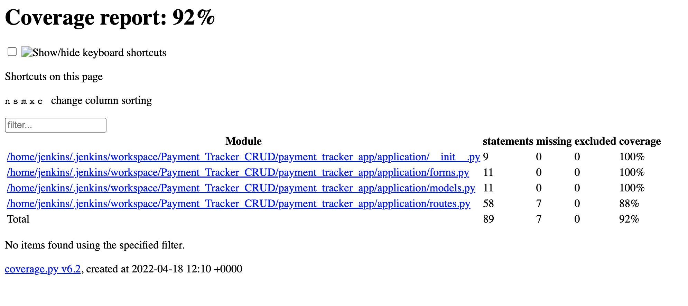
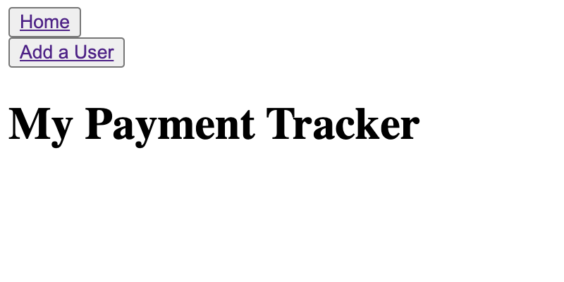

# Payment Tracker CRUD Project

## Contents
* [Introduction](#introduction)  
    * [Objective](#objectives)  
    * [My Project](#my-project)  
    * [My Approach](#my-approach)  
* [Project Planning](#project-planning)  
    * [Risk Assessment](#risk-assessment)  
    * [Trello Board](#trello-board)  
* [Architecture](#architecture)  
    * [Entity Relationship Diagram](#entity-relationship-diagram)  
    * [CI Pipeline](#ci-pipeline)
    * [Jenkins Script](#jenking-script) 
* [Development](#development)  
    * [Unit Testing](#unit-testing)  
    * [Front-End Design](#front-end-design)  
* [Future Improvements](#future-improvements)
* [Video Recording](#video-recording)
* [Authors](#authors)

## Introduction

### Objective 
The objective given for this project is to create a CRUD application with utilisation of supporting tools, methodologies and technologies that encapsulate all core modules covered during training.  

The main constraints are:  
* Kanban Board: Trello or an equivalent Kanban Board  
* Database: GCP SQL Server or other Cloud Hosted managed Database  
* Programming language: Python  
* Unit Testing with Python (Pytest)  
* Front-end: Flask (HTML)  
* Version Control: Git  
* CI Server: Jenkins  
* Cloud server: GCP Compute Engine  

### My Project
My project is a payment tracker. The user will be able to create a user and add payments in their own payments page so that they are able to track each purchase that has been made. Several users can be made so the app is accessible to anybody that wants to track their payments.   

### My Approach
The approach I have taken to be able to create this application successfully and effectively is the following:  
* Have a create functionality for a user  
* Have a create functionality for a new payment  
* Implement read functionality so that the users and their own payments are displayed  
* Implement an update user and payment functionality so the user can change their name and edit their payments as required  
* Implement delete functionality so that if a user doesnt want to be on the app anymore they can delete their payments and their accounts  

## Project Planning  
### Risk Assessment
I have created a detailed risk assessment for my project which can be seen below. This displays each risk that is associated with my project showing the impact level, mitigating and contingent actions.  

A link to the risk assessment is also provided here: https://docs.google.com/spreadsheets/d/1c7kJiDlVX2AVnkvvDFuM9cOhnvSuljjiurIerkE7bvs/edit?usp=sharing


### Trello Board
The website used to track the progress of my project is trello. This was used to create user stories and create cards for each for each process. This allowed maximum efficiency and flow through development in my project.  
  
The link to my trello board is: https://trello.com/b/XQbB5Vz6/crud-board  

  

My board contains:
* User stories so that  each user requirement can be worked towards and met successfully.
* Task cards which outline the tasks needed to be completed to achieve the user story requirements
* Testing tasks required for the software.

I downloaded a powerup called "Card Numbers by Reenhanced" on trello. This powerup allowed me to give each card an ID number. I opted to add CAI which is an acronym for "Crud App Implementation" in front of eah ID number as well so that it is clear that each task is specific to the implementations for my crud app. Using IDs for each card is something i think is essential as these can be used for feature branching during devlopment with Github. Each card ID is also a feature branch on Github clarifying each commit. This allowed smooth and seemless development and aided in the organisation of my project when commiting and pushing to Github.

## Architecture

### Entity Relationship Diagram

Below is my entity relationship diagram (ERD). This displays the structure for my database. Creating this outlined the implementation of the Classes and Forms in my Flask application allowing simpler implementation.  


  

My ERD consists of two tables, the Users and the Payments. There is a one to many relationship from users to payments meaning the user can have multiple payments, however the payments table can only be linked to one user id.

### CI Pipeline


The continuous integration pipeline Is have used has been shown above. This contains the the frameworks used for my project. The steps have been orchestrated in order to take my source code from development to deployment. The automation process has been focused on testing here.  

The way this is carried out is, once any code is pushed to Github, this code will automatically be pushed to Jenkins via a webhook. Jenkins can then run unit and integration tests as well as develop a report so that developer can assess the results from the automated tests run.  

### Jenkins Script  

My Jenkins build:  

Before building the script I had to run the following commands in my VM terminal:

* Update the package manager using "sudo apt update" 
* Install the virutal environment using "sudo apt-get install python3-venv" 
* Install pip3 using "sudo apt install python3-pip"  

The build steps of my Jenkins script are below:

**1.** Insturct the script to use bash as the command interpreter

```  
#!/bin/bash
```  

**2.** Create and activate the virtual environment

```  
python3 -m venv venv  
. ./venv/bin/activate  
```

**3.** Install dependencies

```
cd payment_tracker_app  
pip3 install -r requirements.txt
```
<br/>

**4.** Run the tests and save to a file
```
cd tests  
python3 -m pytest --cov application --cov-report html
```  

## Development
The development stage of my project contains unit testing and the front-end design and development.

### Unit Testing  

I have used pytest to run the tests for my app. Each function has been tested using more than one scenario to build a wider range of test. This increases the confidence in my code as it is succeeding in tests through more than one scenario.

Below is my console output when running the automated uni testing through jenkins.  

  

The report has also been generated after building and running the tests, the results are shown below:  

  

### Front-End Design

My aim for the front-end design was simplicity in looks but high and stable in functionality. I feel that this was achieved as alothough the html output on the webpage is very simple, there are no issues within the functionality of the app.  

Once the user navigates to the URL, the home page is shown:  

  

The user is then able to click the user link at the top of the home page to create a user, they can fill in the user name field provided and click submit when ready:


The user is now redirected back to the home page with their name This displays the successful implementation of the CREATE and READ features for the user:


Now, the user can click on add payment next to their name to add a payment. The user will be redirected to a form which they can fill in:  

  

Once the payment has been added. The user is redirected to a view payments page made specifically for them. This page will allow the user to view,  update and delete their payments whenever needed. This displays successful implementation of the READ feature for the app:


The user can update their payment by clicking the update button, they will be redirected to the update page:


Once the payment is updated, the user will be redirected to the home page from which they can click on view existing payments and see their updated payment. This displays the successful implmentation of the UPDATE feature for payments:


If the user now wants to delete one of their payments, they can view existing payments and click delete. This will delete that payment from their payment tracker displaying the succesful implementation of the DELETE feature for the payment.

Similar to the payment, the user also has update and delete functionality. This is shown on the home page once a user has been added.  

Once the user clicks on update, they will be redirected to the update user page:


Once the user is happy with their update they can click submit and their user name will now be updated once they are redirected to the home page displaying the successful implementation of the UPDATE feature for user:

  

The user can also click delete if they would like to delete the user. This will remove this user from the home page. This displays the succesful implementation of the DELETE feature for the user.

## Future Improvements  
Overall, I would class this project as a success. However this never rules out the opportunity for improvement. Below, is the list of improvements that I would like to implement to future projects:

* I would like to implement more tables in my database, although I opted to keep it simple this time, I feel the addition of more features through new tables such as a bank card table would allow the the app to improve for the users as they can allocate their payments to whatever card they have used. Therefore, improving the way the user budgets and tracks each card payment.

* Another improvement I would like to implement in the future is to use CSS to improve the aesthetics of my app. At the moment, the app aesthetics are very basic with no colour or design. However improving the app design would cause the app to look and feel more professional and well done.

## Video Recording

Here is the link to the video presentation of my project:  

https://drive.google.com/file/d/1QwpI1TXYpVx4t1yQrAbhAxTds_BkfgDD/view?usp=sharing  

I forgot to talk about my actual test classes in the video above. To rectify this, I have created a short video explaining my test classes:  

https://drive.google.com/file/d/1SNdLmPqsYCvmSm4X25ucWrhPj3PUvcSG/view?usp=sharing

## Authors

Talha Saeed


